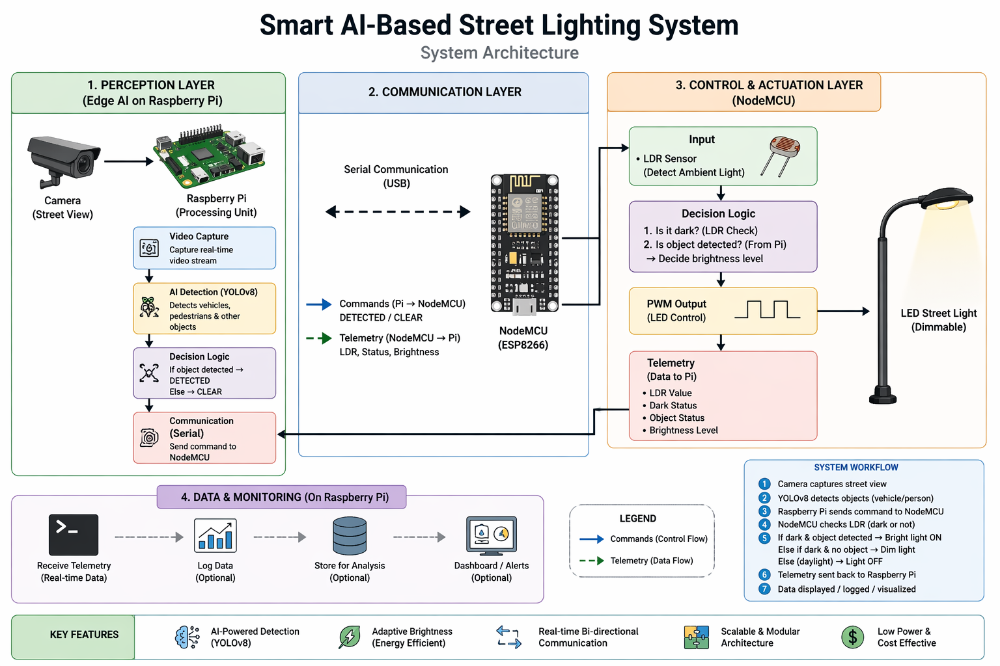
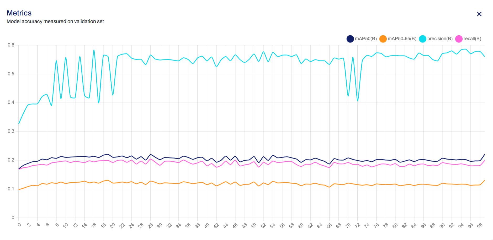
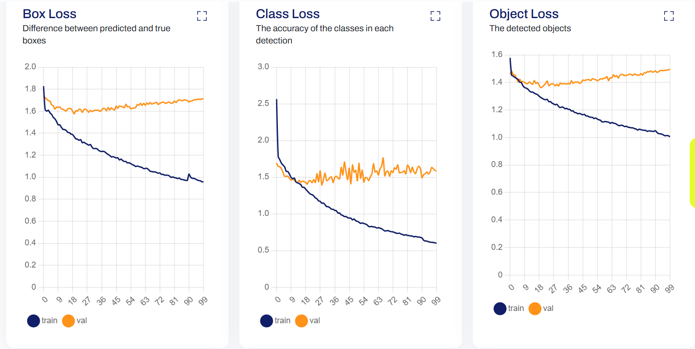

# 💡 AI-Driven Smart Street Lighting System Using Object Detection and Climatic Data

An AI-powered IoT-based smart street lighting system that automatically adjusts street light intensity based on real-time road conditions. The system uses **YOLOv8 object detection**, **computer vision**, and **IoT communication** to detect vehicles and pedestrians and dynamically control LED brightness using PWM.

The project aims to reduce unnecessary energy consumption while maintaining road safety through intelligent adaptive lighting.

---

# 📌 Project Overview

Traditional street lighting systems operate at maximum brightness throughout the night, leading to unnecessary power consumption.

This project introduces an intelligent street lighting system that combines:

- Artificial Intelligence
- Computer Vision
- Deep Learning
- Internet of Things (IoT)
- Embedded Systems

A camera continuously captures road scenes, YOLOv8 detects objects such as vehicles and pedestrians, and the lighting intensity is automatically adjusted according to road activity.

---

# 🎯 Objectives

- Develop an AI-based smart street lighting system.
- Detect vehicles and pedestrians using deep learning.
- Automatically adjust brightness according to traffic conditions.
- Reduce electricity consumption.
- Improve safety through adaptive illumination.
- Analyze performance under different environmental conditions.

---

# 🏗️ System Architecture



```
              Camera Module
                    |
                    ↓
            Image / Video Frames
                    |
                    ↓
              OpenCV Processing
                    |
                    ↓
             YOLOv8 Detection
                    |
                    ↓
       Vehicle & Pedestrian Detection
                    |
                    ↓
          Decision Making Algorithm
                    |
                    ↓
              PWM Brightness Control
                    |
                    ↓
              LED Street Light
                    |
                    ↓
             MQTT IoT Communication
```

---

# ⚙️ Technologies Used

## Artificial Intelligence

- YOLOv8 Object Detection
- Deep Learning
- Computer Vision

## Programming Language

- Python

## Libraries

- OpenCV
- Ultralytics YOLO
- NumPy
- Paho MQTT

## Hardware & IoT

- Raspberry Pi / AI Processing Unit
- Arduino / ESP32 Controller
- Camera Module
- LED Street Light Prototype
- LDR Sensor
- PWM Lighting Control

---

# 🧠 AI Model Details

## YOLOv8 Object Detection

YOLO (You Only Look Once) is a real-time object detection algorithm used to identify multiple objects from images and video streams.

The model predicts:

- Object class
- Bounding box coordinates
- Confidence score

### Detected Classes

The system detects road-related objects:

- Person
- Car
- Motorcycle
- Bus
- Truck

---

# 📂 Dataset Evaluation

The model was evaluated on three different datasets to analyze performance under normal, adverse weather, and complex traffic conditions.

---

# 1. COCO128 Dataset

### Purpose

Baseline evaluation under standard conditions.

### Model Used

YOLOv8s

### Performance

| Metric | Result |
|---|---|
| mAP50 | 94.0% |
| Precision | ~94.0% |
| Recall | ~90.0% |

### Results


---

# 2. ACDC Dataset

### Adverse Conditions Dataset with Correspondences

Used to evaluate performance under:

- Fog
- Rain
- Snow
- Night glare
- Reduced visibility conditions

### Model Used

Roboflow 3.0 Accurate

### Performance

| Metric | Result |
|---|---|
| mAP50 | 58.9% |
| Precision | 64.6% |
| Recall | 52.8% |

### Results


---

# 3. IDD-Lite Dataset

Used for testing complex real-world traffic scenarios:

- Dense traffic
- Unstructured roads
- Multiple viewpoints

### Model Used

YOLOv8m

### Performance

| Metric | Result |
|---|---|
| mAP50 | ~21.0% |
| Precision | ~56.0% |
| Recall | ~19.0% |

### Results





---

# 🔍 Working Principle

## Step 1: Image Acquisition

The camera captures real-time road images and video frames.

↓

## Step 2: Image Processing

OpenCV preprocesses the captured frames.

↓

## Step 3: Object Detection

YOLOv8 identifies vehicles and pedestrians.

Detection output includes:

- Object type
- Location
- Confidence score

↓

## Step 4: Brightness Control

The detected objects control LED intensity.

Example:

```
Vehicle detected:
Brightness = 100%

Pedestrian detected:
Brightness = 70%

No object detected:
Brightness = 20%
```

↓

## Step 5: IoT Communication

MQTT communication transfers control commands between the AI module and lighting controller.

---

# 🔌 Brightness Control Algorithm

```
IF vehicle detected:
        Brightness = 100%

ELSE IF pedestrian detected:
        Brightness = 70%

ELSE:
        Brightness = 20%
```

---

# 🔧 Hardware Implementation

The hardware prototype consists of:

- LED street light model
- Arduino-based controller
- Camera input system
- PWM brightness control
- IoT communication interface

Arduino control code is available:

```
hardware/street_light_control.ino
```

### Hardware Simulation


---

# 📁 Project Structure

```
AI-Driven-Smart-Street-Lighting-System/

│
├── assets/
│   ├── architecture_diag.png
│   ├── coco_results_Loss.png
│   ├── coco_results_map.png
│   ├── acdc_results_Loss.png
│   ├── acdc_results_map.png
│   ├── idd_lite_results_Loss.png
│   ├── idd_lite_results_map.png
│   └── hardware_img_with_sw_simulation.jpeg
│
├── hardware/
│   └── street_light_control.ino
│
├── models/
│
├── samples/
│   ├── adverse_weather.json
│   ├── coco_hub.json
│   └── idd_lite.json
│
├── comms/
│
├── scripts/
│   ├── detection.py
│   └── main.py
│
├── model_handler.py
│
├── config.json
│
├── requirements.txt
│
├── LICENSE
│
└── README.md
```

---

# 🚀 Installation

Clone the repository:

```bash
git clone https://github.com/SnehaJayaram/AI-Driven-Smart-Street-Lighting-System-Using-Object-Detection-and-Climatic-Data.git
```

Install dependencies:

```bash
pip install -r requirements.txt
```

---

# ▶️ Running the Project

Run the main program:

```bash
python scripts/main.py
```

The system performs:

1. Camera frame acquisition
2. YOLOv8 object detection
3. Object classification
4. Brightness decision
5. IoT-based LED control

---

# 📊 Evaluation Summary

The multi-dataset evaluation demonstrates:

| Dataset | mAP50 | Purpose |
|---|---|---|
| COCO128 | 94.0% | Baseline detection performance |
| ACDC | 58.9% | Adverse weather robustness |
| IDD-Lite | ~21.0% | Complex traffic evaluation |

The results show strong performance under normal conditions and highlight challenges in extreme weather and highly complex traffic environments.

---

# ✅ Advantages

- Energy-efficient lighting control.
- Real-time object detection.
- Adaptive brightness adjustment.
- Reduced operational cost.
- Smart city infrastructure support.
- Minimal human intervention.

---

# ⚠️ Limitations

- Detection performance decreases in extreme weather.
- Requires computational resources for real-time processing.
- Camera quality affects detection performance.
- Complex environments require additional training data.

---

# 🔮 Future Enhancements

- Solar-powered smart street lighting integration.
- Cloud-based monitoring dashboard.
- Traffic density prediction.
- Automatic street light fault detection.
- Edge AI deployment using NVIDIA Jetson or Raspberry Pi AI modules.

---

# 📜 License

This project is developed for academic and research purposes.
